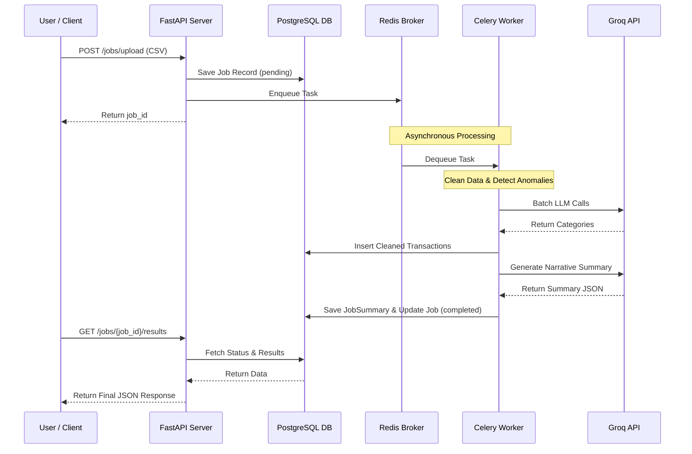

# AI-Powered Transaction Processing Pipeline

This repository contains the backend implementation for an asynchronous transaction processing pipeline. The pipeline accepts a CSV file containing raw financial transactions, processes it using a background job queue to clean data, flags anomalies, and leverages a Large Language Model (Groq's Llama-3.1-8b-instant) to classify transactions and generate a narrative summary.

## Tech Stack
- **API Framework:** FastAPI (Python)
- **Database:** PostgreSQL (with SQLAlchemy ORM)
- **Job Queue:** Celery + Redis
- **LLM Integration:** Groq API (Llama 3.1)
- **Containerization:** Docker & Docker Compose

## Prerequisites
- Docker and Docker Compose installed on your system.
- A Groq API Key from the Groq console.

## Setup Instructions

1. Clone the repository and navigate to the root directory.
2. Ensure you have the `transactions.csv` file available (place it in the root if necessary, though it is mounted dynamically in the endpoints).
3. Export your Groq API key as an environment variable in your terminal:
   ```bash
   export GROQ_API_KEY="your_actual_api_key"
   ```
   *On Windows (PowerShell):*
   ```powershell
   $env:GROQ_API_KEY="your_actual_api_key"
   ```

4. Run the entire stack with a single command:
   ```bash
   docker compose up --build
   ```

   This command will start the following services:
   - `db` (PostgreSQL)
   - `redis` (Redis Broker & Backend)
   - `api` (FastAPI Server on `http://localhost:8000`)
   - `worker` (Celery Worker)

The API will automatically create the required database tables on startup.

## API Endpoints & Example cURL Requests

### 1. Upload CSV & Start Job
```bash
curl -X POST "http://localhost:8000/jobs/upload" \
  -H "accept: application/json" \
  -H "Content-Type: multipart/form-data" \
  -F "file=@transactions.csv"
```
**Response:**
```json
{
  "job_id": "f5b8a6a1-..."
}
```

### 2. Check Job Status
```bash
curl -X GET "http://localhost:8000/jobs/{job_id}/status" -H "accept: application/json"
```

### 3. Retrieve Job Results
```bash
curl -X GET "http://localhost:8000/jobs/{job_id}/results" -H "accept: application/json"
```

### 4. List All Jobs
```bash
curl -X GET "http://localhost:8000/jobs" -H "accept: application/json"
```

Filter by status (e.g., `completed`):
```bash
curl -X GET "http://localhost:8000/jobs?status=completed" -H "accept: application/json"
```

## High-Level Architecture
You can view the high-level architecture diagram below (Mermaid format). You can paste this into [Mermaid Live Editor](https://mermaid.live/) or draw.io to visualize it.



## System Design & Choices
- **FastAPI:** High performance, built-in validation (Pydantic), and async support.
- **Celery + Redis:** Industry-standard for robust, resilient asynchronous task queues.
- **PostgreSQL:** Reliable relational database suited for structured transaction and job data.
- **Groq API:** Used `llama-3.1-8b-instant` for incredibly fast, cost-effective LLM processing, making batch calls to avoid rate limits and reduce latency.

## Production Best Practices Implemented
To ensure this application is strictly production-ready, several robust software engineering practices have been applied across the codebase:
- **Centralized Configuration:** Adherence to the Twelve-Factor App methodology using `pydantic-settings` to manage environment variables gracefully in `config.py`.
- **Advanced Data Engineering:** The anomaly detection pipeline leverages purely vectorized operations in Pandas/NumPy (avoiding `iterrows`) to achieve maximum performance across massive datasets.
- **Strict Typing & Documentation:** Comprehensive Python Type Hinting and Google-style docstrings are applied systematically to improve IDE support and team maintainability.
- **Observability:** Complete integration with Python's standard `logging` library ensures high visibility into Celery tasks, combined with a global FastAPI exception handler to gracefully trap and manage 500-level errors.
- **Security-First Docker:** The Dockerfile executes the application strictly as a newly created non-root user (`alemeno`) and utilizes `.dockerignore` to secure build contexts and protect sensitive API keys.
- **Continuous Integration (CI):** A GitHub Actions pipeline is configured to automatically validate Docker Compose configurations and verify that container images build successfully on every push, ensuring the main branch remains deployable.
